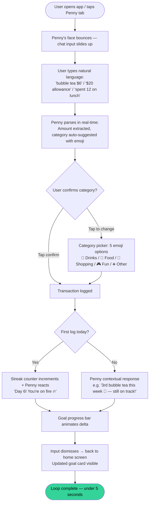
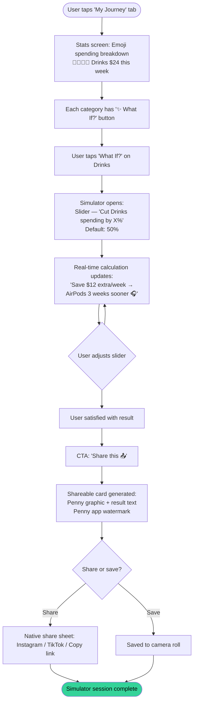
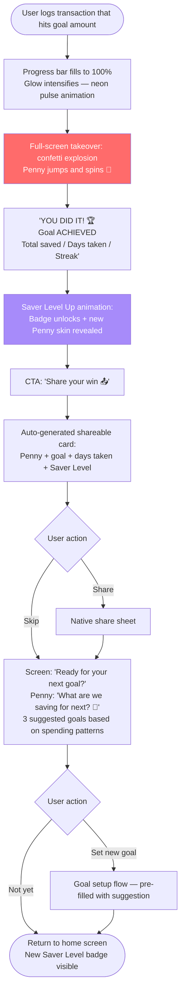

# UX Design Specification Penny

**Author:** Itobeo
**Date:** 2026-04-05

---

<!-- UX design content will be appended sequentially through collaborative workflow steps -->

## Executive Summary

### Project Vision

Penny is a free Progressive Web App (PWA) that reframes personal finance for teenagers as a companion experience rather than a budgeting tool. Built on the PiggyMetrics microservices foundation, Penny is a complete rebrand centered on a single animated pig mascot — also named Penny — who acts as financial advisor, emotional anchor, and habit coach. Every interaction flows through her. The core insight: teens don't need a dashboard, they need a saving buddy.

### Target Users

**Primary:** Teens aged 13–19 with any income source (allowance, part-time job, birthday money, gig work) who want to save for a specific goal — AirPods, sneakers, a trip, a car. They are already motivated to save; they just need a system that doesn't feel like homework. No bank account required. They discover Penny via a shared link on TikTok or Instagram and must be actively using the app within 90 seconds of clicking.

**Not targeted in v1:** Under-13s, parents (no oversight features), adults.

### Key Design Challenges

1. **Cold start on PWA** — The onboarding flow is make-or-break. A teen tapping a social media link on mobile must reach their first "aha moment" (goal set + Penny introduced) in under 2 minutes or they abandon.
2. **Manual logging fatigue** — No bank connection means every transaction is manual. The Penny chat-style quick-add must feel as effortless as sending a text message, or churn happens within days.
3. **Mascot consistency at scale** — Penny's mood states, voice, and contextual reactions must feel alive and personal across every screen and interaction — not like a static illustration on a finance app.

### Design Opportunities

1. **What If Simulator as the hero feature** — No competitor has this. It should be prominently discoverable, not buried. Its shareable output card (screenshot-worthy, TikTok/Instagram native) is the primary viral distribution mechanic.
2. **Milestone moments as distribution events** — Goal countdown mode, completion celebrations, Saver Level unlocks — each is a moment teens will screenshot and share. Design these as mini-campaigns, not just UI states.
3. **Teen-native language as UX** — "Money In / Money Out," "My Vibe," "Penny Says," "Boring Stuff ⚙️" — the copy IS the experience. Language consistency across every touchpoint signals to teens that this was genuinely made for them.

## Core User Experience

### Defining Experience

The core loop of Penny is: **log → see progress → feel motivated → log again**. The most frequent and critical user action is transaction logging via the Penny chat-style quick-add. Every other feature (streaks, simulator, stats) is downstream of this habit. If logging feels like homework, the product fails regardless of how good everything else is.

### Platform Strategy

- **Primary:** PWA, mobile-first — teens discover via TikTok/Instagram links on their phone and must be in the app within 90 seconds
- **Secondary:** Web desktop — full feature parity, responsive layout
- **Input model:** Touch-primary on mobile, mouse/keyboard on desktop
- **Offline:** Core logging and goal progress viewing must work offline; sync on reconnect
- **Installable:** PWA must support home screen installation — this is the retention anchor

### Effortless Interactions

- **Transaction logging:** Tap Penny → type natural language ("bubble tea $6") → Penny parses and confirms → done. Target: under 5 seconds, zero form fields
- **Goal progress check:** Visible on home screen hero card without any navigation — zero taps
- **Milestone sharing:** One tap from any celebration screen to generate and share a card
- **Onboarding:** Goal set + Penny introduced in under 2 minutes, no bank connection, no password form

### Critical Success Moments

1. **The Onboarding Aha** — Goal set, price entered, Penny calculates the weekly target, Penny introduces herself. This must happen in under 2 minutes. If it doesn't, the user is gone.
2. **The First Streak Hook** — Day 3 of daily logging, Penny reacts with genuine excitement ("3 days! You're on a roll 🔥"). This is the moment habit formation begins.
3. **The What If Revelation** — First time a teen uses the simulator and sees "cut bubble tea in half → AirPods 3 weeks sooner." This is the screenshot moment — the feature that gets shared.
4. **The Goal Completion Celebration** — Full-screen confetti, Saver Level up, new Penny skin unlocked. This is the viral distribution event. Design it as a mini-campaign, not a toast notification.

### Experience Principles

1. **Penny first, features second** — Every screen is a conversation with Penny, not a dashboard. Features exist to give Penny something to say.
2. **Logging must be faster than texting** — If transaction entry takes more than 5 seconds, it's too slow. No exceptions.
3. **Progress over perfection** — Always show improvement and momentum. Never surface raw negative numbers or shame. "Glow Up" view is the default.
4. **Every milestone is a distribution event** — Design celebrations (streaks, goal progress, level ups, completion) as shareable moments first, UI feedback second.
5. **PWA must feel native** — No pinch-zoom, no horizontal scroll, no desktop-first layouts on mobile. If it feels like a website on a phone, it fails.

## Desired Emotional Response

### Primary Emotional Goals

1. **Capable** — Teens feel empowered and trusted, not lectured or monitored. The emotional baseline is "I've got this." Penny is a peer, not a parent.
2. **Seen** — "This was made for me." Every language choice, interaction, and visual signals that the teen is the primary user — not an afterthought of an adult product.
3. **Excited about progress** — Money feels like momentum, not anxiety. Users feel hopeful and energized by their trajectory, not stressed by their balance.
4. **Delighted by Penny** — Small, surprising moments of genuine personality from Penny create emotional attachment. These are the moments teens remember, screenshot, and share.

### Emotional Journey Mapping

| Stage | Target Emotion |
|---|---|
| Discovery (social media link) | Curiosity → "wait, this looks different" |
| Onboarding | Excitement → "I can actually do this" |
| Daily logging | Effortless → habit, not chore |
| Streak milestone | Pride + delight → Penny celebrates with them |
| What If Simulator first use | Revelation → "I never thought about it like that" |
| Goal completion | Euphoria + identity shift → "I'm a saver now" |
| Return visits | Belonging → Penny missed them |

### Micro-Emotions

- **Confidence over confusion** — every screen has one clear action; users always know what to do next
- **Trust over skepticism** — no bank connection, no hidden permissions, no parental surveillance = trust by design
- **Excitement over anxiety** — progress framing everywhere; deficits and shortfalls are never the default view
- **Belonging over isolation** — Penny's reactions make users feel known and remembered, not like an anonymous account

### Emotions to Avoid

- **Shame** — never surface spending in a way that makes teens feel bad about themselves
- **Anxiety** — no red numbers, no "you're behind," no deficit-first framing
- **Surveillance** — no parental oversight, no data-sharing language, no "your guardian can see this"
- **Condescension** — Penny never says "you should," never lectures, never uses adult finance jargon

### Design Implications

- **Capable** → Penny's voice is peer-to-peer ("supportive older sibling"), never authoritative. Banned words: budget, expense, income, should, must.
- **Seen** → Teen language is non-negotiable at every touchpoint. Any adult finance term that slips through is a UX bug.
- **Excited about progress** → "Glow Up" stats view is the default. Raw numbers are one tap away but never the first thing seen.
- **Delighted** → Penny has ~20 distinct contextual reaction templates. Repetition kills delight — no reaction should feel automated or generic.
- **Belonging** → Penny's return-visit greeting references the user's specific context ("You're $12 away from AirPods 🎧") — never a generic "Welcome back!"

## UX Pattern Analysis & Inspiration

### Inspiring Products Analysis

**Duolingo**
- Streak system with genuine emotional consequence (owl devastated on break) drives daily habit formation
- Gamified progression (XP, levels, leagues) makes learning feel like a game
- Lesson completion celebrations are unskippable — forces the dopamine moment
- *Penny adaptation:* Streak system + Penny's emotional reaction on break; Saver Level progression

**Instagram Stories**
- Swipeable card format makes content consumption effortless and familiar
- Vertical full-screen format is native to mobile thumb interaction
- Stories disappear — creates urgency and recency without overwhelming history
- *Penny adaptation:* Stories-style weekly spending summary; swipeable milestone cards

**Spotify Wrapped**
- Annual recap reframes data as identity ("I'm a Jazz person")
- Shareable format designed for social media — the product markets itself
- Positive framing: celebrates what you did, not what you didn't
- *Penny adaptation:* Penny Wrapped (Phase 2); shareable Saver Level cards; "Spending Personality of the Week"

**BeReal**
- Random-timed prompt creates authentic, low-effort engagement habit
- "Right now" framing reduces perfectionism — just log what happened
- *Penny adaptation:* "Penny Check!" random daily logging prompt (Phase 2)

**Duolingo + Tamagotchi (hybrid concept)**
- Mascot with emotional states creates parasocial attachment
- User feels responsible for the mascot's wellbeing — drives return visits
- *Penny adaptation:* Penny's mood reflects financial health; Penny looks sad when streak breaks

### Transferable UX Patterns

**Navigation Patterns:**
- **Bottom tab bar (mobile)** — 5 tabs max, Penny's face as center primary CTA (like Instagram's camera button). Familiar, thumb-reachable, zero learning curve.
- **Stories/card swipe** — horizontal swipe for weekly summaries and milestone cards. Native to how teens already consume content.

**Interaction Patterns:**
- **Natural language input** — type "bubble tea $6" like a text message; Penny parses it. Eliminates form fields entirely for the core action.
- **Unskippable celebration animations** — 2-second full-screen takeover for milestones. Forces the emotional moment before moving on.
- **Streak counter always visible** — persistent in the UI, not buried in a stats screen. Visibility drives the habit.
- **One-tap sharing** — shareable cards generated instantly from any milestone; no export flow, no editing required.

**Visual Patterns:**
- **Dark mode as default** — signals "this is for you" to teens before they read a word
- **Chunky progress bars** — large, satisfying visual fill. Progress should feel physical.
- **Emoji as data visualization** — 🧋🧋🧋🧋🧋 vs 🍟🍟 communicates spending patterns without numbers

### Anti-Patterns to Avoid

- **Dashboard-first layout** — opening to a wall of charts and numbers (Greenlight, GoHenry). Teens disengage before they understand what they're looking at.
- **Form-based transaction entry** — dropdown category + amount field + date picker = homework. Every additional field is a churn risk.
- **Red numbers for overspending** — creates anxiety and shame. Never use red to indicate negative financial states.
- **Generic notifications** — "Don't forget to log today!" with no context. Penny's nudges must reference the user's specific goal and streak.
- **Passive analytics** — showing what happened without suggesting what to do next. Penny is proactive, not a rearview mirror.
- **Adult finance language anywhere** — "income," "expense," "budget," "net worth" — any of these appearing in the UI is a UX bug.

### Design Inspiration Strategy

**Adopt directly:**
- Duolingo's streak emotional consequence system → Penny's streak + reaction mechanic
- Instagram Stories swipe format → weekly summary cards
- Spotify Wrapped's identity-reframing data presentation → Saver Level cards, Spending Personality

**Adapt for Penny:**
- Duolingo's gamified progression → Saver Levels (simpler, goal-completion-gated rather than XP-based)
- BeReal's random prompt → "Penny Check!" (optional, not mandatory — teens hate feeling surveilled)
- Tamagotchi's emotional mascot → Penny's mood states (financial health indicator, not a pet to feed)

**Avoid entirely:**
- Snapchat's social pressure mechanics → social features are Phase 2; v1 is solo experience
- Any pattern that requires account linking, bank connection, or parental approval

## Design System Foundation

### Design System Choice

**Tailwind CSS + shadcn/ui** — a themeable component foundation with full ownership and customization.

### Rationale for Selection

- **Dark mode first-class:** Both Tailwind and shadcn/ui treat dark mode as a core feature, not an afterthought — critical for Penny's default dark experience
- **Full ownership:** shadcn/ui components are copied into the codebase, not imported from a locked library — Penny owns every component and can modify freely
- **Speed + uniqueness balance:** Structural components (forms, modals, navigation) use the system; brand-defining components (Penny mascot, progress bars, celebration animations, shareable cards) are fully custom
- **Mobile-first by default:** Tailwind's responsive utilities make PWA mobile layouts fast and consistent
- **Accessibility built-in:** shadcn/ui components are built on Radix UI primitives — WCAG compliance without extra effort

### Implementation Approach

- **System components** (use as-is or lightly themed): navigation tabs, modals, input fields, buttons, toasts
- **Themed components** (system base + Penny brand tokens): cards, progress bars, badges, avatars
- **Fully custom components:** Penny mascot + mood states, What If Simulator slider, celebration animations, shareable milestone cards, stories-style weekly summary

### Customization Strategy

**Design tokens to define:**
- Color palette: dark background base, vibrant accent (primary brand color TBD), semantic colors (success, warning — no red for negative states)
- Typography: rounded, friendly typeface (e.g., Plus Jakarta Sans or Nunito) — not the sharp geometric fonts of adult finance apps
- Spacing scale: generous padding, chunky touch targets (min 44px) for mobile
- Border radius: rounded corners throughout — soft, approachable, not corporate
- Animation: spring-based transitions (Framer Motion) for Penny reactions and celebrations — not linear easing

## Core User Experience

### Defining Experience

> **"Tap Penny, tell her what you spent, watch your goal get closer."**

Penny's defining experience is conversational transaction logging — the core interaction teens will describe to friends. The mental model is messaging, not accounting. Users type naturally ("bubble tea $6") the same way they'd text a friend about what they bought. Penny handles the rest.

### User Mental Model

Teens already narrate their spending to friends via text. Penny's quick-add hijacks this existing behavior — the input feels like sending a message, not filling out a form. This is the key insight that separates Penny from every competitor: the mental model is iMessage, not Excel.

**What existing solutions get wrong:** Every competitor treats logging as form-filling — dropdown category + amount field + date picker + save button. Four interactions where there should be one. Teens abandon within days.

### Success Criteria

- Logging a transaction takes under 5 seconds from tap to confirmation
- Zero required form fields — natural language input only
- Penny's response feels contextual and personal, never generic
- Goal progress visibly updates immediately after every log
- Streak counter increments on first log of the day — visible feedback that the habit is alive

### Novel UX Patterns

**Pattern type:** Familiar patterns combined in a novel way — no user education required.

- **Messaging UI** (established) — chat-style input, Penny's response bubble, conversational thread feel
- **Financial logging** (established but hated) — amount, category, date
- **The novel combination:** Penny parses natural language and responds with contextual financial insight at the moment of logging — not in a separate analytics screen, but right there in the conversation

This is the interaction no competitor has. Greenlight shows you a chart later. Penny talks to you now.

### Experience Mechanics

**1. Initiation**
- Penny's animated face is the center tab in the bottom navigation — always visible, always one tap away
- Penny blinks when idle; bounces when there's new content or a streak milestone
- Tapping Penny is the primary CTA — not a "+" button, not a menu item. Penny IS the action.

**2. Interaction**
- Chat-style input slides up (iMessage-style bottom sheet)
- User types naturally: "bubble tea $6" / "$6 boba" / "spent 6 on drinks"
- Penny parses: extracts amount, auto-suggests category with emoji (🧋 Drinks)
- One tap to confirm; one tap to change category if wrong
- Optional: add note or date (collapsed by default — not required)

**3. Feedback**
- Penny responds immediately with a contextual message (~20 templates, never generic):
  - "3rd bubble tea this week 🧋 — still $12 ahead of your weekly target though!"
  - "Nice, logged! You're now $87 into your AirPods goal 🎧"
- Goal progress bar animates the delta
- Streak counter increments if first log of the day (with Penny celebration if milestone)

**4. Completion**
- Input dismisses automatically after confirmation
- User lands back on home screen with updated goal card
- Total flow time target: under 5 seconds

## Visual Design Foundation

### Color System

**Base palette (dark mode default):**
- `--background`: #0F0F14 (near-black with slight purple undertone — not pure black)
- `--surface`: #1A1A24 (card/component background)
- `--surface-elevated`: #242433 (modals, bottom sheets)
- `--border`: #2E2E42 (subtle dividers)

**Brand colors:**
- `--primary`: #FF6B6B (warm coral — energetic, warm, distinctly Penny)
- `--primary-foreground`: #FFFFFF
- `--secondary`: #A78BFA (soft purple — stats, progress, secondary actions)
- `--accent`: #34D399 (mint green — success states, Money In, goal progress)

**Semantic colors (no red for negative):**
- `--success`: #34D399 (mint green — Money In, streaks, goals hit)
- `--warning`: #FBBF24 (amber — spending alerts, gentle nudges)
- `--muted`: #6B7280 (secondary text, disabled states)

**Text:**
- `--foreground`: #F9FAFB (primary text)
- `--muted-foreground`: #9CA3AF (secondary text)

**Light mode:** Available as opt-in via "My Vibe" settings — inverted palette with warm off-white base (#FAFAF8), same brand colors.

**Accessibility:** All text/background combinations target WCAG AA minimum (4.5:1 contrast ratio). Primary coral on dark background: ~5.2:1 ✅

### Typography System

**Primary typeface:** Nunito (Google Fonts — free, no licensing cost)
- Rounded terminals signal approachability and warmth
- Excellent legibility at small sizes on dark backgrounds
- Variable font — single file covers all weights

**Type scale:**
| Token | Size | Weight | Use |
|---|---|---|---|
| `display` | 32px / 2rem | 800 | Goal amount, celebration numbers |
| `h1` | 24px / 1.5rem | 700 | Screen titles |
| `h2` | 20px / 1.25rem | 700 | Card headers, section titles |
| `h3` | 16px / 1rem | 600 | Sub-headers, labels |
| `body` | 15px / 0.9375rem | 400 | Body text, Penny messages |
| `small` | 13px / 0.8125rem | 400 | Captions, metadata |
| `micro` | 11px / 0.6875rem | 500 | Badges, tags |

**Line heights:** 1.5 for body, 1.2 for display/headings — tight headings, comfortable reading.

### Spacing & Layout Foundation

**Base unit:** 8px

**Spacing scale:**
- `xs`: 4px — icon gaps, tight inline spacing
- `sm`: 8px — within-component spacing
- `md`: 16px — between related elements
- `lg`: 24px — between sections within a card
- `xl`: 32px — between cards/major sections
- `2xl`: 48px — screen-level padding, hero spacing

**Touch targets:** Minimum 44×44px for all interactive elements (Apple HIG + WCAG 2.5.5)

**Border radius:**
- `sm`: 8px — tags, badges, small chips
- `md`: 16px — cards, inputs, buttons
- `lg`: 24px — bottom sheets, modals
- `full`: 9999px — pills, avatar frames, Penny's face container

**Layout grid (mobile):** 16px horizontal padding, single column, max content width 390px
**Layout grid (desktop):** Centered single column, max-width 480px — Penny is a focused app, not a wide dashboard

**Animation:**
- Spring physics via Framer Motion for Penny reactions and celebrations
- `duration-150` for micro-interactions (button press, toggle)
- `duration-300` for transitions (screen change, bottom sheet)
- `duration-500` for celebrations (progress bar fill, confetti)
- Reduced motion: respect `prefers-reduced-motion` — replace spring animations with instant state changes

### Accessibility Considerations

- All color combinations meet WCAG AA (4.5:1 text, 3:1 UI components)
- No information conveyed by color alone — emoji + text always paired with color signals
- Touch targets minimum 44px — critical for teen mobile users
- `prefers-reduced-motion` respected throughout
- Focus indicators visible in keyboard navigation (desktop)
- Penny's mascot reactions include text equivalents for screen readers

## Design Direction Decision

### Design Directions Explored

Six directions were explored: Gradient Hero, Minimal Dark, Card Stack, Neon Accent, Playful Chunky, and Stories-First. Each applied the established visual foundation (dark base, coral/purple/mint palette, Nunito, rounded corners) with a distinct personality and layout approach.

### Chosen Direction

**Direction 4: Neon Accent**

Near-black base (#0F0F14) with glowing neon treatments on key interactive elements. Radial light blobs create depth and atmosphere. Progress bars and streak counters glow in coral/purple. Stat cards have neon-bordered edges. The overall feel is premium dark UI with high-energy accents — the aesthetic language of gaming and high-end consumer apps, applied to personal finance.

### Design Rationale

- Signals "this is for you" to teens immediately — the aesthetic is familiar from games, Discord, and premium mobile apps they already use
- Dark base reduces eye strain for evening use (when teens are most active on their phones)
- Neon glow on progress elements makes goal advancement feel exciting and rewarding — the visual language of leveling up
- Radial light blobs add depth and atmosphere without requiring illustration assets
- Distinct enough from every competitor (all of whom use light, corporate, or childish aesthetics) to be immediately recognizable

### Implementation Approach

- CSS radial gradients for atmospheric background blobs (no image assets needed)
- `box-shadow` with color for neon glow effects on cards and progress bars
- Framer Motion spring animations for glow pulse on streak milestones
- Progress bar glow intensifies as goal percentage increases — visual feedback tied to progress
- Penny mascot rendered against a softly glowing circular backdrop (coral radial gradient)

## User Journey Flows

### Journey 1: Onboarding (First-Time User)

**Goal:** Teen taps a shared link, sets a saving goal, meets Penny, and logs their first transaction — all in under 2 minutes.

```mermaid
flowchart TD
    A([Tap shared link / visit penny.app]) --> B[Animated landing: Penny waves\n'Hi! I help teens save for stuff 🐷']
    B --> C[CTA: 'Start saving' — Google/Apple login]
    C --> D{Login success?}
    D -->|No| C
    D -->|Yes| E[Screen: 'What are you saving for?'\nVisual goal cards: Tech / Fashion / Travel / Food / Other]
    E --> F[User selects or types custom goal]
    F --> G[Screen: 'How much does it cost?'\nLarge number input, currency auto-detected]
    G --> H[Screen: 'When do you want it by?'\nDate picker with quick options: 1 month / 3 months / 6 months / Custom]
    H --> I[Penny calculates: 'Save $31/week → AirPods by June 15 🎧'\nAnimated Penny appears, excited]
    I --> J[Screen: 'How do you get money?'\nAllowance / Part-time job / Both / Other]
    J --> K[Penny introduction moment:\n'Hi! I'm Penny, your saving buddy 🐷\nI'll cheer you on, keep you on track,\nand never judge your bubble tea habit.']
    K --> L[CTA: 'Let's go!' → Home screen]
    L --> M[Home screen: Goal card glowing,\nstreak = 0, Penny idle-blinking]
    M --> N{Optional: Log first transaction?}
    N -->|Skip| O([Onboarding complete])
    N -->|Log it| P[Penny chat input slides up]
    P --> Q[User types e.g. 'got $20 allowance']
    Q --> R[Penny: 'First Money In logged! 🎉\nYou're $20 closer to AirPods']
    R --> O
```

**Key constraints:**
- Zero passive screens — every screen requires one action
- No bank connection prompt anywhere in this flow
- Skip available at every step after goal entry
- Total target: under 2 minutes to home screen

---

### Journey 2: Transaction Logging (Daily Core Loop)

**Goal:** Teen logs a transaction in under 5 seconds via Penny chat input.

**Key constraints:**
- Zero required form fields — natural language only
- Category confirmation is one tap, not a form
- Penny's response is always contextual (references goal + streak), never generic
- Full flow must complete in under 5 seconds

---

### Journey 3: What If Simulator

**Goal:** Teen discovers the simulator, adjusts a spending category, sees the impact on their goal timeline, and shares the result.

**Key constraints:**
- Simulator accessible from stats screen, not buried in settings
- Calculation updates in real-time as slider moves (no submit button)
- Shareable card is auto-generated — no editing required
- Card includes Penny branding for organic distribution

---

### Journey 4: Goal Completion Celebration

**Goal:** Teen reaches their savings goal — the viral moment designed as a distribution event.

**Key constraints:**
- Celebration is unskippable for 2 seconds (forces the emotional moment)
- Shareable card is auto-generated, no editing required
- Re-engagement prompt appears immediately after celebration — no dead end
- Saver Level up is tied to goal completion, not arbitrary XP

---

### Journey Patterns

**Entry patterns:**
- All primary actions accessible from bottom nav in ≤1 tap
- Penny tab (center) is always the fastest path to logging
- Deep links from notifications land directly on the relevant screen

**Feedback patterns:**
- Every user action gets an immediate visual response (< 100ms)
- Penny's text response appears within 300ms of transaction confirmation
- Progress animations always show the delta, not just the new state

**Error recovery patterns:**
- Wrong category: one tap to change, no re-entry of amount
- Accidental log: swipe-to-delete from transaction history, Penny acknowledges ("Got it, removed 🐷")
- Offline: transactions queue locally, sync silently on reconnect — no error shown to user

### Flow Optimization Principles

1. **Every flow has a skip** — no user is ever trapped; skipping never loses data already entered
2. **Progress is never lost** — partial onboarding saves state; returning user resumes where they left off
3. **Celebrations are unskippable for 2 seconds** — the emotional moment must land before the user can move on
4. **Share is always one tap from a milestone** — never more than one tap between "I achieved something" and "I can share this"
5. **Dead ends don't exist** — every terminal screen has a clear next action (re-engagement prompt, return to home, or set new goal)

## Component Strategy

### Design System Components

From **shadcn/ui** (themed with Penny design tokens, no structural changes):
- `Button` — primary (coral), secondary (purple), ghost variants
- `Input` — used only in onboarding number fields; chat input is custom
- `Sheet` — bottom sheet for Penny chat input and category picker
- `Dialog` — goal completion celebration overlay
- `Badge` — streak counter, Saver Level badge
- `Tabs` — bottom navigation base
- `Slider` — What If Simulator slider
- `Progress` — base for goal progress bar (heavily themed)
- `Toast` — lightweight feedback for non-Penny moments

### Custom Components

#### 1. PennyAvatar
**Purpose:** Penny's animated face — the emotional core of every screen.
**States:** idle (slow blink), happy (bounce), excited (spin), sad (droop), celebrating (jump + sparkles)
**Variants:** `sm` (nav tab, 40px), `md` (home screen, 80px), `lg` (celebration, 160px)
**Anatomy:** Circular container with coral radial glow backdrop + Lottie animation layer
**Accessibility:** `aria-label="Penny, your saving buddy"` + `role="img"`; animations respect `prefers-reduced-motion`
**Implementation:** Lottie JSON animations for each state; fallback to static emoji 🐷 if Lottie fails

#### 2. GoalProgressCard
**Purpose:** Home screen hero — shows goal name, progress bar, amount saved, weekly target.
**States:** default, near-goal (within $30 — glow intensifies, color shifts to accent), complete (triggers celebration)
**Anatomy:** Dark surface card → goal emoji + name → chunky progress bar with neon glow → "$87 of $249" → "Save $31 this week" → streak badge
**Interaction:** Tap card → expands to full goal detail view
**Accessibility:** Progress bar has `role="progressbar"` with `aria-valuenow`, `aria-valuemin`, `aria-valuemax`

#### 3. PennyChatInput
**Purpose:** The core logging interaction — natural language transaction entry.
**States:** collapsed (hidden), open (slides up as bottom sheet), parsing (Penny thinking indicator), confirmed (Penny response visible)
**Anatomy:** Bottom sheet → text input (large, auto-focus) → real-time parse preview (amount + category emoji) → confirm button → optional category picker row
**Interaction:** Opens on Penny tab tap; dismisses on confirm or swipe down
**Accessibility:** Auto-focus on open; `aria-label="Tell Penny what you spent"`; keyboard submit on Enter

#### 4. PennyResponseBubble
**Purpose:** Penny's contextual message after a transaction log — the emotional feedback moment.
**States:** appearing (slide up + fade in), idle, dismissing
**Anatomy:** Rounded speech bubble (coral border, dark fill) → Penny avatar (sm) → message text → optional CTA
**Content:** ~20 template messages, selected contextually based on: category, frequency, streak state, goal proximity
**Accessibility:** `role="status"` + `aria-live="polite"` so screen readers announce Penny's response

#### 5. WhatIfSimulator
**Purpose:** Slider-based spending trade-off tool with real-time goal impact calculation.
**Anatomy:** Category label + emoji → spending amount this week → slider (0–100% reduction) → impact statement → Share CTA
**Interaction:** Slider updates impact statement in real-time (debounced 100ms)
**Share output:** Auto-generated canvas card via `html2canvas`
**Accessibility:** Slider has `aria-label`, `aria-valuetext` with human-readable description of current setting

#### 6. ShareableCard
**Purpose:** Auto-generated image card for milestones, simulator results, and Saver Level ups.
**Variants:** `milestone`, `simulator`, `level-up`, `weekly-roast`
**Anatomy:** Fixed 1080×1920px canvas (Stories format) → Penny branding → dynamic content → app watermark
**Implementation:** `html2canvas` renders hidden DOM element to canvas → PNG download or native share sheet

#### 7. StreakBadge
**Purpose:** Persistent streak counter — always visible, drives daily habit.
**States:** active (🔥 + count), at-risk (Penny worried, shown if no log by 8pm), broken (Penny sad, count resets)
**Placement:** Home screen (top right of goal card) + My Journey tab header
**Accessibility:** `aria-label="X day streak"` on the badge element

#### 8. StoriesWeeklySummary
**Purpose:** Instagram Stories-style swipeable weekly recap.
**Anatomy:** Full-width card stack → 4–5 cards: week overview, top category, goal delta, streak highlight, Penny's verdict
**Interaction:** Horizontal swipe or tap right/left half to navigate
**Accessibility:** Arrow key navigation on desktop; each card has descriptive `aria-label`

### Component Implementation Strategy

- All custom components built with Tailwind utility classes + CSS variables from design tokens
- Lottie for Penny animations (lightweight, scalable, designer-editable without code changes)
- `html2canvas` for shareable card generation (client-side, no server dependency)
- Framer Motion for spring animations on progress bars, sheet transitions, and celebrations
- All components export typed props (TypeScript) with JSDoc

### Implementation Roadmap

**Phase 1 — Core (required for MVP launch):**
- `PennyAvatar`, `GoalProgressCard`, `PennyChatInput`, `PennyResponseBubble`, `StreakBadge`

**Phase 2 — Engagement (required for v1 feature completeness):**
- `WhatIfSimulator`, `ShareableCard`, `StoriesWeeklySummary`

**Phase 3 — Polish (nice-to-have for v1):**
- Additional Penny animation states, `ShareableCard` additional variants

## UX Consistency Patterns

### Button Hierarchy

**Primary** (coral, filled) — one per screen maximum. The single most important action: "Let's go," "Confirm," "Share your win."

**Secondary** (purple, outlined) — supporting actions: "See details," "Change category," "Set new goal."

**Ghost** (text only, muted) — low-emphasis actions: "Skip," "Not yet," "Boring Stuff ⚙️."

**Destructive** (amber, not red) — "Delete transaction," "Clear goal" — amber signals caution without shame/alarm.

**Rules:**
- Never two primary buttons on the same screen
- CTAs use active verbs in Penny's voice ("Let's go" not "Submit"; "Share your win" not "Share")
- Minimum 44px touch target on all buttons
- Loading state: button text replaced with Penny's thinking indicator (animated dots), not a spinner

### Feedback Patterns

**Penny response** (primary feedback) — used after every transaction log. `PennyResponseBubble` with contextual message. Always positive or neutral framing.

**Toast** (secondary feedback) — used for background actions (sync complete, settings saved). Bottom of screen, auto-dismisses in 3s. Never used for errors that need action.

**Inline validation** — used in onboarding forms only. Appears on blur, not on keystroke. Green checkmark for valid, amber warning for fixable issues. Never red.

**Full-screen celebration** — used for goal completion and Saver Level up only. Unskippable for 2 seconds. Confetti + Penny animation + sound (respects device silent mode).

**Empty states** — always include Penny with an encouraging message and a clear CTA. Never a blank screen or generic "No data" text.
- No transactions yet: "Everyone starts at zero. Even Bezos did. Log your first $1 🐷" + "Tell Penny" CTA
- No goal set: "What are we saving for? 🎧" + "Set a goal" CTA

### Form Patterns

- **One question per screen** in onboarding — never stack multiple fields
- **Large inputs** — font size 24px+ for number entry
- **No required field asterisks** — if optional, say so in plain language
- **Auto-advance** where possible — after selecting a goal card, advance automatically
- **Keyboard type matching** — `inputmode="decimal"` for numbers; autocorrect off for text
- **No dropdowns** — use visual card selectors or emoji pickers instead

### Navigation Patterns

**Bottom tab bar:**
| Tab | Icon | Label |
|---|---|---|
| 1 | 📊 | My Stuff |
| 2 | 📈 | My Journey |
| 3 | 🐷 PennyAvatar | *(no label)* |
| 4 | 💬 | Penny Says |
| 5 | ✨ | My Vibe |

- Penny tab (center): always slightly larger, no label, bounces when new content
- No nested navigation deeper than 2 levels from any tab
- Back navigation: swipe right (mobile) or browser back — no back button in header
- Modals/sheets dismiss on swipe down or tap outside

### Modal & Overlay Patterns

- **Bottom sheet** — Penny chat input, category picker, goal detail. Dismiss: swipe down or tap backdrop.
- **Full-screen overlay** — goal completion, Saver Level up only. Unskippable for 2 seconds.
- **Inline expansion** — transaction detail, What If Simulator. No navigation change.
- **Rule:** Never stack modals — use inline expansion within a sheet instead.

### Loading & Skeleton States

- **Skeleton screens** (not spinners) for initial data load — match content shape
- **Optimistic updates** — transactions appear immediately; sync in background
- **Penny thinking indicator** — animated dots while parsing NL input (< 300ms target)
- **Offline mode** — amber dot on streak badge for pending sync; no error state shown; full core functionality available offline

## Responsive Design & Accessibility

### Responsive Strategy

Penny is **mobile-first by design** — the primary use case is a teen tapping a TikTok link on their phone. Desktop is a supported secondary surface, not an afterthought.

**Mobile (320px–767px) — primary:**
- Single column, full-width cards
- Bottom tab navigation, fixed to viewport bottom
- Touch targets minimum 44px
- Bottom sheet for all overlays (never centered modals on mobile)
- Thumb-zone optimized: primary actions in bottom 60% of screen

**Tablet (768px–1023px):**
- Same layout as mobile — Penny is a focused single-column app
- Slightly increased padding and font sizes
- Bottom nav remains (no sidebar)

**Desktop (1024px+):**
- Centered single column, max-width 480px
- Remaining space: subtle dark background with faint Penny brand pattern
- Bottom nav fixed to bottom of the 480px column
- Keyboard shortcuts: Enter to submit chat input, Escape to dismiss sheets
- Hover states on all interactive elements

**PWA installation:**
- `manifest.json` configured for home screen installation on iOS and Android
- Standalone display mode (no browser chrome when installed)
- Splash screen: Penny on dark background with coral glow
- Theme color: #0F0F14

### Breakpoint Strategy

Standard Tailwind breakpoints — no custom breakpoints needed:
- Base styles: mobile (no breakpoint)
- `md` (768px): slight spacing/font size increase
- `lg` (1024px): centered column, hover states, keyboard shortcuts

### Accessibility Strategy

**Target: WCAG 2.1 Level AA**

**Color & contrast:**
- All text/background combinations ≥ 4.5:1 (AA)
- UI components ≥ 3:1
- No information conveyed by color alone — emoji + text always paired with color signals
- Amber (not red) for warnings — accessible to red-green colorblind users

**Keyboard navigation (desktop):**
- All interactive elements reachable via Tab
- Focus ring: 2px coral outline, visible on all backgrounds
- Skip link: "Skip to main content" as first focusable element
- Bottom sheet: focus trapped inside when open; returns to trigger on close
- Celebration overlay: focus trapped; Escape or Enter to dismiss after 2s

**Screen reader support:**
- Semantic HTML throughout (`<nav>`, `<main>`, `<button>`, `<progress>`)
- `aria-live="polite"` on `PennyResponseBubble`
- `role="progressbar"` with `aria-valuenow/min/max` on goal progress bar
- `aria-label` on all icon-only buttons
- Penny animation states described via `aria-label` updates

**Motion & animation:**
- All animations respect `prefers-reduced-motion: reduce`
- Reduced motion: spring animations → instant state changes; confetti → static celebration screen

**Touch & motor:**
- Minimum 44×44px touch targets
- Swipe gestures have tap alternatives
- No time-limited interactions except the 2-second celebration (auto-advances)

### Testing Strategy

**Responsive:** Chrome DevTools + real devices (iPhone SE, iPhone 15, Android mid-range). Browser matrix: Chrome, Safari iOS, Firefox, Edge.

**Accessibility:** `axe-core` in CI (zero violations policy), VoiceOver manual testing on key flows, keyboard-only navigation of all 4 critical journeys, color blindness simulation.

### Implementation Guidelines

- Semantic HTML — `<button>` not `
`, `<nav>` not `
`
- All images/icons have `alt` text or `aria-hidden="true"` if decorative
- Form inputs always have associated `<label>` (visible or `sr-only`)
- Use `rem` units for font sizes
- Test at 200% browser zoom — layout must not break
- `lang="en"` on `<html>` element
